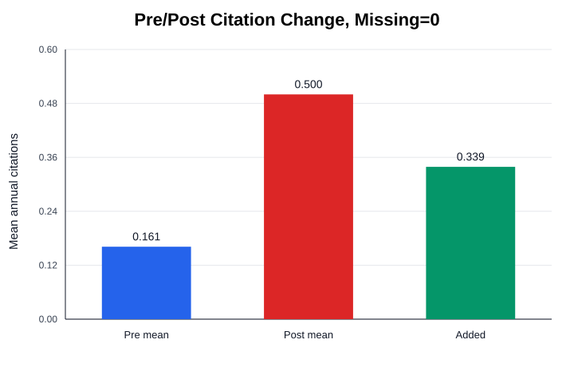
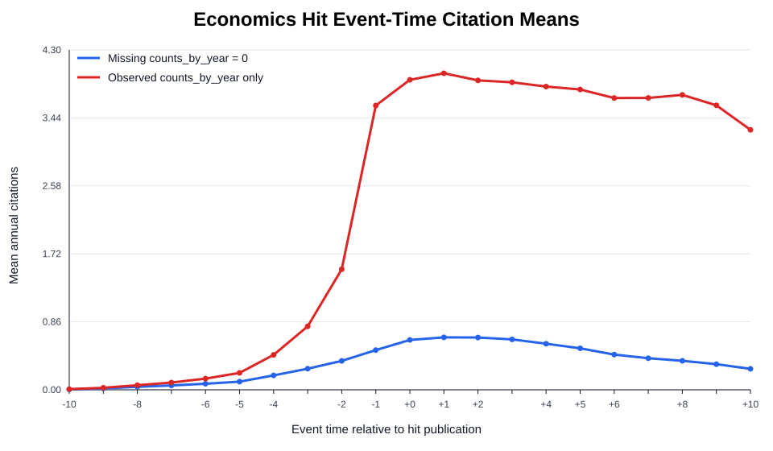
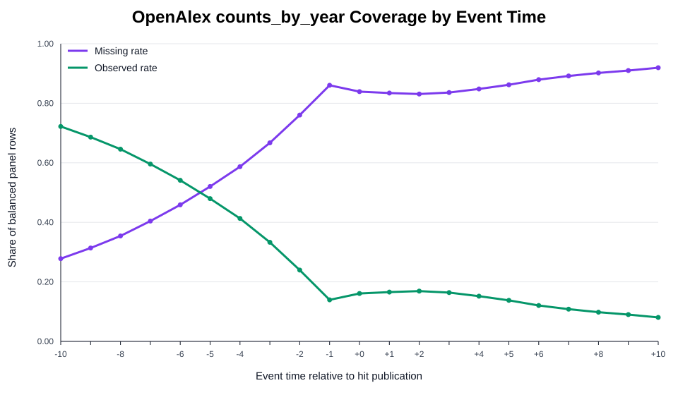

# Economics Hit-Effect Analysis

This note reports the first-pass economics analysis of whether an author's highly cited publication is followed by higher citations to the same author's older, unrelated papers.

## Design

- Unit: paper-author-hit-event-year.
- Subject: OpenAlex economics, econometrics, and finance works.
- Hit paper threshold: more than 100 citations.
- Hit prevalence criterion: the hit accounts for at least 50% of the author's included citations.
- Focal-paper criterion: at least 3 older papers by the author that are not cited by the hit paper.
- Balanced event window: 10 years before through 10 years after hit publication.
- Citation variable: OpenAlex `counts_by_year`; missingness is tracked explicitly with `citations_observed`.

## Core Counts

- Economics works: 7,924,745
- Candidate hit-author rows: 25,724
- Accepted hit-author events: 11,158
- Unique focal works: 70,986
- Paper-author-hit pairs: 76,074
- Balanced event-panel rows: 1,597,554

## Results

| Estimate | Value |
|---|---:|
| Mean pre-hit annual citations, missing=0 | 0.1612 |
| Mean post-hit annual citations, missing=0 | 0.5000 |
| Mean added annual citations, missing=0 | +0.3388 |
| Observed-only pairs with both pre and post observations | 26,092 |
| Mean added annual citations, observed-only | +2.0412 |

## counts_by_year Missingness

The balanced panel is structurally complete, but OpenAlex `counts_by_year` is sparse. This is material and asymmetric around the hit year.

| Period | Missing Rate | Missing Rows | Total Rows |
|---|---:|---:|---:|
| Overall | 70.27% | 1,122,628 | 1,597,554 |
| Pre-hit | 52.04% | 395,876 | 760,740 |
| Post-hit | 86.85% | 726,752 | 836,814 |

## Event-Time Table

| Event Time | Mean, Missing=0 | Mean, Observed Only | Missing Rate |
|---:|---:|---:|---:|
| -10 | 0.0056 | 0.0077 | 27.78% |
| -9 | 0.0173 | 0.0252 | 31.37% |
| -8 | 0.0372 | 0.0576 | 35.43% |
| -7 | 0.0549 | 0.0922 | 40.42% |
| -6 | 0.0764 | 0.1412 | 45.87% |
| -5 | 0.1027 | 0.2142 | 52.04% |
| -4 | 0.1829 | 0.4427 | 58.69% |
| -3 | 0.2674 | 0.8030 | 66.70% |
| -2 | 0.3657 | 1.5257 | 76.03% |
| -1 | 0.5021 | 3.5973 | 86.04% |
| +0 | 0.6310 | 3.9224 | 83.91% |
| +1 | 0.6631 | 4.0047 | 83.44% |
| +2 | 0.6614 | 3.9150 | 83.10% |
| +3 | 0.6379 | 3.8904 | 83.60% |
| +4 | 0.5827 | 3.8361 | 84.81% |
| +5 | 0.5243 | 3.7996 | 86.20% |
| +6 | 0.4448 | 3.6914 | 87.95% |
| +7 | 0.3999 | 3.6929 | 89.17% |
| +8 | 0.3664 | 3.7318 | 90.18% |
| +9 | 0.3243 | 3.5989 | 90.99% |
| +10 | 0.2647 | 3.2893 | 91.95% |

## Interpretation

The first-pass before/after comparison shows higher annual citations to older unrelated focal papers after the author has a hit. With missing `counts_by_year` treated as zero, the increase is about 0.34 citations per paper-author-hit-year. Among observed citation histories, the increase is larger, about 2.04 citations per year, but this observed-only estimate is harder to interpret because missingness rises sharply after the hit year.

This is not yet a causal estimate. The next step should add controls or matched non-hit author-paper histories and model paper age, calendar year, author fixed effects, and paper fixed effects.