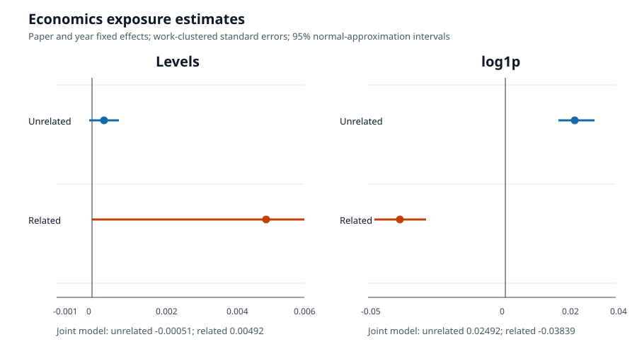
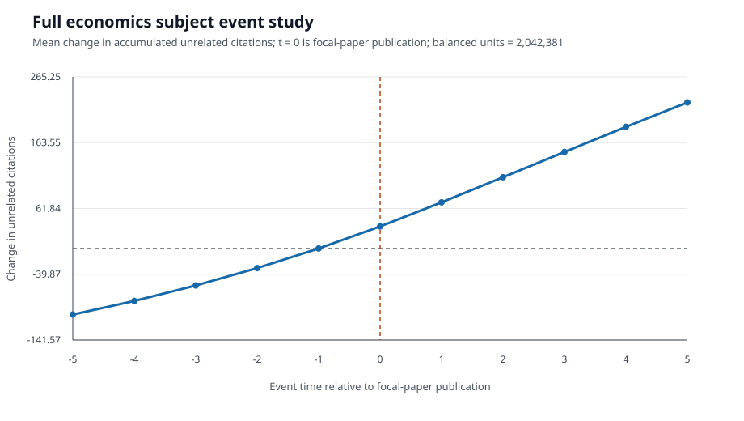

# Economics Output Generation

This note records how the current economics diagnostics were generated.

## Panel

1. Read the economics subject tables from `/root/sdb1/openalex/subjects/subject_level.duckdb`, including works, authorships, and reference edges.
2. Restricted author histories to article/review works published 1990–2020.
3. Kept authors with at least 5 subject papers and at least 3 papers before a focal paper.
4. Sampled 4/250 authors and retained at most 5,000 authors; focal works were sampled 1/2 through a stable hash.
5. Restricted focal publication years to 1990–2019 and excluded each focal work from its own author history.
6. Built author-paper-year rows for publication years 1990–2025, beginning at paper age 1.
7. Defined related work as a direct reference edge in either direction between an author's history and the focal work. All other eligible history papers contributed to unrelated exposure.
8. Aggregated lagged cumulative citations through years before each row year. No pre-publication rows or negative exposures were retained.

The resulting panel contains 211,825 rows, 14,675 focal works, and 2,853 authors. Annual focal-paper citations were reconstructed from `referenced_works` across the full snapshot, not from sparse `counts_by_year` fields. The resulting citation file is `calculated_citations_by_year.csv.gz`. The panel uses those reconstructed counts as its outcome and records the source in `citation_source`.

## Outputs

### Sample Diagnostics

| Quantity | Value |
|---|---:|
| Panel rows | 211,825 |
| Focal works | 14,675 |
| Authors | 2,853 |
| Years | 1992–2025 |
| Zero annual outcome share | 70.3% |
| Zero related-exposure share | 43.5% |
| Zero unrelated-exposure share | 10.4% |

### Regression Results

Coefficients are reported with work-clustered standard errors in parentheses.

| Variable | Levels: unrelated only | Levels: joint | log1p: unrelated only | log1p: joint |
|---|---:|---:|---:|---:|
| Unrelated exposure | 0.000344 (0.000215) | -0.000511 (0.000306) | 0.01219 (0.00298) | 0.02492 (0.00296) |
| Related exposure | — | 0.00492 (0.00251) | — | -0.03839 (0.00477) |
| Observations | 211,825 | 211,825 | 211,825 | 211,825 |
| Paper/year FE | Yes | Yes | Yes | Yes |



The levels joint model shows a positive conditional association for related
exposure and a small negative coefficient for unrelated exposure. The log1p
joint model reverses both signs. The result is not a contradiction in the
database; it shows that the relationship is sensitive to the scale used for
highly skewed count variables. The current evidence therefore supports using
these outputs to choose and test specifications, not to claim a stable effect.

## Full-Subject Event Study

The full economics subject event study uses all eligible article/review
focal-paper-author pairs rather than the author hash sample. Focal papers are
published 1995–2020, authors must have at least 3 earlier subject papers, and
the balanced window is `t = -5,...,5`, where `t = 0` is focal-paper publication.
Each unit contributes all 11 event times. Related history papers are removed
using direct reference edges in either direction; the outcome is the change in
accumulated citations to the remaining unrelated history papers relative to
`t = -1`.

| Event time | Mean change in unrelated citations |
|---:|---:|
| -5 | -102.20 |
| -4 | -81.11 |
| -3 | -57.23 |
| -2 | -30.30 |
| -1 | 0.00 |
| 0 | 34.08 |
| 1 | 71.34 |
| 2 | 110.11 |
| 3 | 149.16 |
| 4 | 187.98 |
| 5 | 225.88 |



The panel is balanced across 2,042,381 focal-paper-author units, producing
22,466,191 event-time observations. The pre-treatment values are negative by
construction because cumulative citation stock is being compared with the
later `t = -1` baseline. The post-treatment increase is descriptive and should
not be read as a causal treatment effect: the graph has no cohort controls,
calendar-year adjustment, author fixed effects, or inference bands. Its current
purpose is to show the subject-wide timing pattern and provide a diagnostic
target for the next event-study specification.

The level diagnostic estimates:

```text
citations_jt ~ accumulated_unrelated_citations_jt + paper FE + year FE
citations_jt ~ accumulated_unrelated_citations_jt + accumulated_related_citations_jt + paper FE + year FE
```

The log1p robustness output applies `log(1 + x)` to the outcome and both exposure variables before absorbing the same paper and year effects. Both specifications use work-clustered standard errors. The renderer residualizes variables by paper and year, estimates OLS on the residuals, and reports normal-approximation p-values.

These outputs measure the conditional association between a focal paper's later annual citations and an author's accumulated citations to other subject papers, separated by direct reference relatedness. They are diagnostics, not causal estimates. The design remains sensitive to exposure definition, citation measurement, selection, timing, and inference choices.

Live outputs are stored under `/root/sdb1/openalex/subjects/prevalence_regressions_economics_duckdb_v3/`:

- `economics_exposure.csv.gz`
- `economics_prevalence_regressions.html`
- `economics_prevalence_regressions_log1p.html`
- `economics_exposure.diagnostics.json`

The event-study generator is `scripts/build_economics_unrelated_event_study.py`.
Its live outputs are:

- `event_study/unrelated_citation_change_by_event_time.csv`
- `event_study/unrelated_citation_change_event_study.svg`
- `event_study/summary.json`
