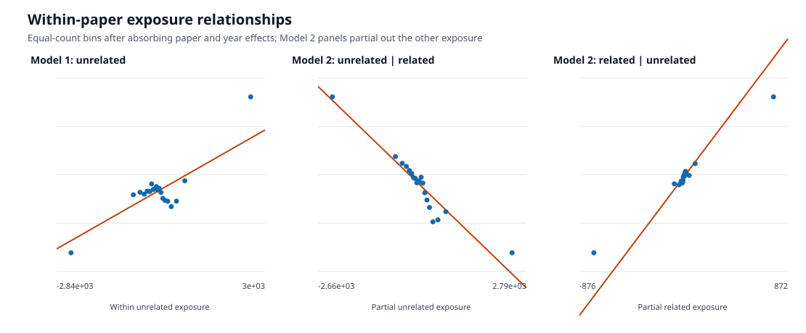
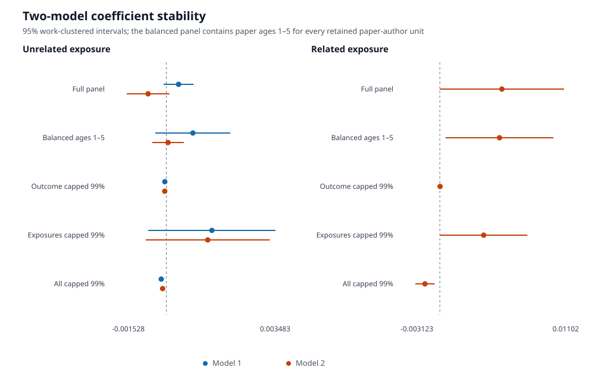

# Economics Results From The Two Specified Models

This document reports the two fixed-effects regressions built from the
economics exposure panel. These regressions are retained as a separate
descriptive analysis; they do not estimate the effect of receiving a hit on an
author's unrelated papers.

## Models

The outcome is annual citations to focal paper `j`. Unrelated and related
exposures are accumulated citations, through the prior year, to the author's
other economics papers. Related papers have a direct reference edge with the
focal paper in either direction.

```text
Model 1:
citations_jt ~ unrelated_exposure_jt + paper FE + year FE

Model 2:
citations_jt ~ unrelated_exposure_jt
             + related_exposure_jt
             + paper FE + year FE
```

Both models absorb focal-paper and calendar-year effects. Standard errors are
clustered by focal work.

## Data Used

| Quantity | Value |
|---|---:|
| Paper-author-year rows | 211,825 |
| Focal works | 14,675 |
| Authors | 2,853 |
| Focal paper-author units | 14,796 |
| Zero annual-citation outcomes | 70.3% |
| Zero unrelated exposure | 10.4% |
| Zero related exposure | 43.5% |

The outcome is reconstructed from reference edges across the OpenAlex
snapshot. A focal paper can appear once for each sampled author, so its
paper-year outcome can be repeated across coauthors. Work-clustered inference
accounts for dependence among those repeated observations, while the point
estimate remains paper-author weighted.

## Primary Estimates

| Variable | Model 1 | Model 2 |
|---|---:|---:|
| Unrelated exposure | 0.000344 (0.000215) | -0.000511 (0.000306) |
| Related exposure | — | 0.004917 (0.002513) |
| Within R-squared | 0.0039 | 0.2053 |
| Observations | 211,825 | 211,825 |

Model 1 does not provide precise evidence of an unrelated-exposure
association (`p = 0.109`). In Model 2, unrelated exposure is negative
(`p = 0.095`) and related exposure is positive but lies almost exactly on the
conventional 5% boundary (`p = 0.0504`).

The within-paper correlation between related and unrelated exposure is `0.329`.



The binned relationships show the same decomposition as the regressions.
Unrelated exposure slopes upward when entered alone. Conditional on related
exposure, its slope turns downward. Conditional related exposure slopes upward.
The end bins carry much of each relationship.

## Tail And Balance Checks

The models were re-estimated on a balanced paper-age panel and after separate
99th-percentile caps. The outcome cap is 26 annual citations. The exposure caps
are 13,844 unrelated citations and 1,402.76 related citations.

| Analysis | Model 1: unrelated | Model 2: unrelated | Model 2: related | Model 1 R² | Model 2 R² |
|---|---:|---:|---:|---:|---:|
| Full panel | 0.000344 (0.000215) | -0.000511 (0.000306) | 0.004917 (0.002513) | 0.0039 | 0.2053 |
| Balanced ages 1–5 | 0.000746 (0.000537) | 0.000049 (0.000226) | 0.004724 (0.002182) | 0.0075 | 0.0532 |
| Outcome capped at 99% | -0.000041 (0.000012) | -0.000044 (0.000013) | 0.000015 (0.000015) | 0.0015 | 0.0015 |
| Exposures capped at 99% | 0.001280 (0.000911) | 0.001165 (0.000889) | 0.003474 (0.001767) | 0.0106 | 0.0114 |
| Outcome and exposures capped | -0.000142 (0.000024) | -0.000103 (0.000025) | -0.001180 (0.000390) | 0.0034 | 0.0056 |



The balanced age-1-to-5 panel contains all 14,796 paper-author units at each of
five ages, for 73,980 observations. Its related coefficient remains positive.

The tail checks show:

1. Capping only exposure values preserves a positive related coefficient:
   `0.003474` with standard error `0.001767`.
2. Capping only annual focal-paper citations removes the related association:
   `0.000015` with standard error `0.000015`.
3. Model 2's within R-squared falls from `0.2053` to `0.0015` when only the
   outcome is capped.
4. When outcomes and exposures are all capped, both Model 2 coefficients are
   negative.

The positive levels relationship is therefore concentrated among extreme
focal-paper citation years. It is not distributionally stable.

## Scope

These regressions ask whether citations to an author's other papers predict
annual citations to a focal paper. They are not the hit event study and should
not be interpreted as evidence that receiving a hit raises citations to the
author's unrelated papers.

The hit-centered analysis is documented separately in
[`economics_results_brief.md`](economics_results_brief.md).

## Reproducibility

The regression analysis is generated by
`scripts/analyze_two_model_research.py`. Exact estimates and figure data are
stored in:

- `reports/subjects/two_model_research.csv`
- `reports/subjects/two_model_research.json`
