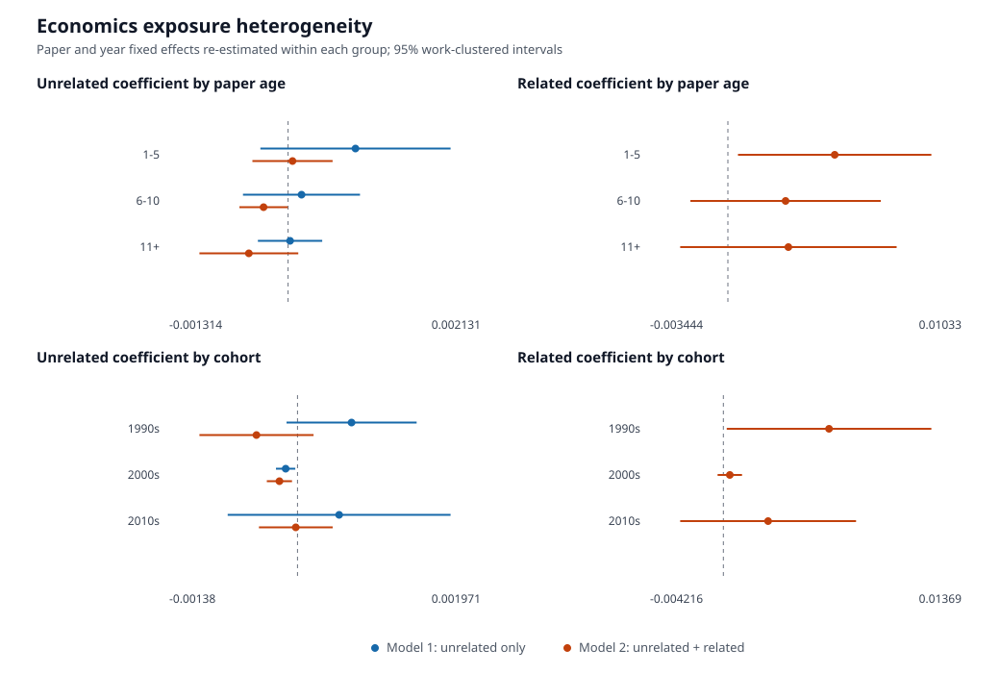

# Economics Results Brief

This document collects the current exploratory results from the economics
subject database. The estimates describe conditional associations and should
not yet be interpreted as causal effects.

## Research Specifications

The outcome is annual citations to focal paper `j`. Exposure is accumulated
citations to the author's other economics papers through the prior year.
Related papers have a direct reference edge with the focal paper in either
direction; all other eligible history papers are unrelated.

The two levels specifications are:

```text
Model 1:
citations_jt ~ accumulated_unrelated_citations_jt + paper FE + year FE

Model 2:
citations_jt ~ accumulated_unrelated_citations_jt
             + accumulated_related_citations_jt
             + paper FE + year FE
```

Both models absorb focal-paper and calendar-year effects and use standard
errors clustered by focal work. The analysis panel has 211,825
paper-author-year rows, 14,675 focal works, and 2,853 authors.

## Main Results

Coefficients and work-clustered standard errors are:

| Variable | Model 1 | Model 2 |
|---|---:|---:|
| Unrelated exposure | 0.000344 (0.000215) | -0.000511 (0.000306) |
| Related exposure | — | 0.004917 (0.002513) |
| Observations | 211,825 | 211,825 |
| Paper/year effects | Yes | Yes |


Model 1 combines citation stocks with different relationships to the focal
paper. Once related exposure is separated in Model 2, the unrelated coefficient
changes from positive to negative while related exposure is positive and much
larger. Per 100 accumulated citations, Model 2 corresponds to approximately
`-0.051` annual focal-paper citations for unrelated exposure and `+0.492` for
related exposure.

The log1p robustness model reverses both Model 2 signs:

| Variable | Levels | log1p |
|---|---:|---:|
| Unrelated exposure | -0.000511 (0.000306) | 0.02492 (0.00296) |
| Related exposure | 0.004917 (0.002513) | -0.03839 (0.00477) |

This scale sensitivity means the current estimates do not establish a stable
structural effect.

## Paper-Age Heterogeneity

The two levels models were re-estimated within each paper-age group. Values
below are effects per 100 accumulated citations.

| Paper age | Model 1: unrelated | Model 2: unrelated | Model 2: related |
|---|---:|---:|---:|
| 1–5 | 0.0746 (0.0537) | 0.0049 (0.0226) | 0.4724 (0.2182) |
| 6–10 | 0.0149 (0.0330) | -0.0270 (0.0136) | 0.2552 (0.2147) |
| 11+ | 0.0022 (0.0181) | -0.0434 (0.0279) | 0.2676 (0.2442) |

The clearest related-exposure association occurs during paper ages 1–5. At
older ages, related coefficients are smaller and their confidence intervals
include zero. In ages 6–10, unrelated exposure is negative after related
exposure is included.

## Publication-Cohort Heterogeneity

Values are again effects per 100 accumulated citations.

| Focal cohort | Model 1: unrelated | Model 2: unrelated | Model 2: related |
|---|---:|---:|---:|
| 1990s | 0.0581 (0.0357) | -0.0442 (0.0313) | 0.6075 (0.3001) |
| 2000s | -0.0128 (0.0053) | -0.0195 (0.0069) | 0.0371 (0.0359) |
| 2010s | 0.0448 (0.0612) | -0.0019 (0.0202) | 0.2572 (0.2579) |



The 1990s cohort has the clearest related coefficient. Later-cohort estimates
are not distinguishable from zero. This pattern may reflect citation-window
length, cohort composition, or reference coverage rather than a decline in the
underlying mechanism.

## Full-Subject Event-Time Result

The event-time analysis uses all eligible economics article/review
focal-paper-author pairs rather than the analysis-panel hash sample. The panel
is balanced from `t = -5` through `t = 5`; `t = 0` is focal-paper publication
and `t = -1` is normalized to zero.

| Event time | Mean change in accumulated unrelated citations |
|---:|---:|
| -5 | -102.20 |
| -4 | -81.11 |
| -3 | -57.23 |
| -2 | -30.30 |
| -1 | 0.00 |
| 0 | 34.08 |
| 1 | 71.34 |
| 2 | 110.11 |
| 3 | 149.16 |
| 4 | 187.98 |
| 5 | 225.88 |


The event panel contains 2,042,381 focal-paper-author units and 22,466,191
event-time observations. The pre-treatment values are mechanically negative
because cumulative citation stock is compared with the later `t = -1`
baseline. The post-treatment increase is descriptive; this graph does not yet
include cohort controls, calendar-year adjustment, author effects, or
confidence intervals.

## Interpretation

The strongest descriptive pattern is not a general positive relationship
between all other-paper citations and focal-paper citations. Instead, the
positive levels association is concentrated in citation exposure tied to
directly related papers, especially early in the focal paper's life and among
older publication cohorts.

Three issues prevent a causal interpretation:

1. Levels and log1p estimates have opposite signs.
2. Related exposure may proxy for latent paper or author quality, common topic
   demand, or coordinated citation timing.
3. The subgroup and event-time results do not yet include multiple-testing
   correction or modern staggered-treatment event-study controls.

The next research step is to estimate count-model, lead/lag, placebo, and
self-citation-exclusion specifications on the same frozen sample.

Exact subgroup estimates are in
`reports/subjects/economics_specification_heterogeneity.csv`.
