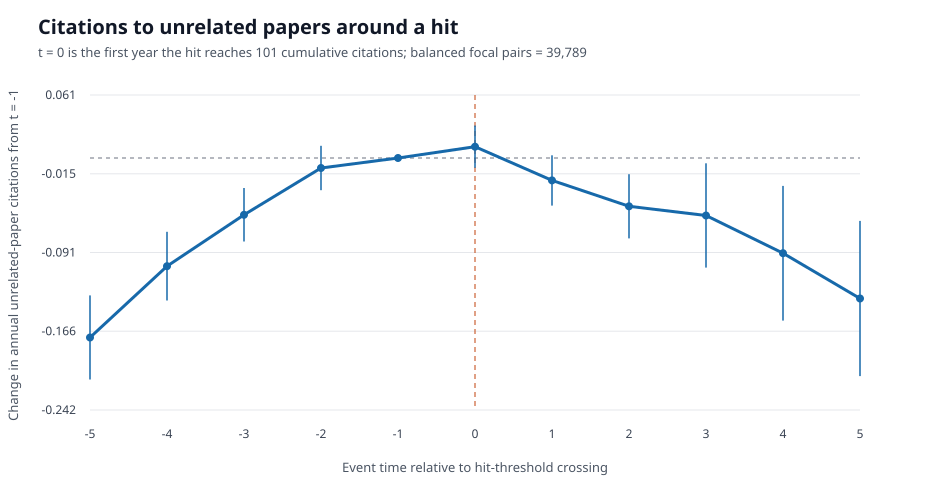

# Basic Economics Hit Event Study

This document reports the descriptive event study aligned with the research
question: does an author's hit paper increase citations to the author's
pre-existing, unrelated papers?

The earlier regressions with focal-paper citations on the left-hand side do
not answer this question and are not used here.

## Design

The treatment event is the first year a hit paper reaches 101 cumulative
reconstructed citations. Candidate hits come from the existing hit sample:

- at least 101 lifetime citations;
- at least 50% of the author's included economics citations;
- at least 3 eligible pre-existing unrelated papers.

For each hit-author event, the outcome papers:

- were published before the hit crossed the threshold;
- belong to the same author;
- are not the hit paper;
- are not referenced by the hit.

The outcome is each unrelated paper's annual citation count. The event window
is balanced from `t = -5` through `t = 5`, where `t = 0` is threshold crossing.
Every retained paper-author-hit pair appears at all 11 event times. Results are
reported as pair-level changes from `t = -1`, with confidence intervals
clustered by author.

This is a basic descriptive event study. It does not use a control group or
difference-in-differences design.

## Sample

| Quantity | Value |
|---|---:|
| Hit authors | 5,515 |
| Hit-author events | 5,515 |
| Distinct hit works | 4,446 |
| Unrelated paper-author-hit pairs | 39,789 |
| Balanced event-panel rows | 437,679 |
| Event window | -5 to +5 |

## Results

| Event time | Mean annual citations | Change from `t = -1` | Author-clustered 95% interval |
|---:|---:|---:|---:|
| -5 | 0.7631 | -0.1725 | [-0.2129, -0.1321] |
| -4 | 0.8316 | -0.1039 | [-0.1370, -0.0709] |
| -3 | 0.8810 | -0.0545 | [-0.0803, -0.0288] |
| -2 | 0.9259 | -0.0096 | [-0.0309, 0.0117] |
| -1 | 0.9355 | 0.0000 | [0.0000, 0.0000] |
| 0 | 0.9465 | 0.0109 | [-0.0094, 0.0313] |
| 1 | 0.9140 | -0.0215 | [-0.0457, 0.0026] |
| 2 | 0.8891 | -0.0464 | [-0.0773, -0.0155] |
| 3 | 0.8803 | -0.0552 | [-0.1053, -0.0051] |
| 4 | 0.8440 | -0.0915 | [-0.1562, -0.0268] |
| 5 | 0.8005 | -0.1350 | [-0.2096, -0.0604] |

## Interpretation

Citations to unrelated papers rise steadily before the hit crosses the
threshold. At `t = 0`, the mean increase relative to `t = -1` is only `0.0109`
citations per paper and its confidence interval includes zero. Citations then
decline after the threshold year.

The graph therefore shows no discrete increase in unrelated-paper citations
when the hit reaches 101 cumulative citations. Instead, threshold crossing
occurs near the peak of an already rising citation path.

Because this analysis has no untreated comparison group, the post-hit decline
cannot be interpreted as a negative causal effect. Paper aging, author career
timing, field trends, and the mechanical selection of hits can all shape the
event path. The defensible conclusion is descriptive: this basic event study
does not show the prominence increase hypothesized at the hit threshold.

## Reproducibility

The event study is generated by `scripts/build_basic_hit_event_study.py`.

Repository outputs:

- `reports/subjects/basic_hit_event_study.csv`
- `reports/subjects/basic_hit_event_study.json`
- `docs/assets/basic_hit_event_study.svg`

The balanced micro-panel is stored outside Git at:

`/root/sdb1/openalex/subjects/economics_econometrics_and_finance/analysis/hit_event_study_threshold/panel.csv.gz`
