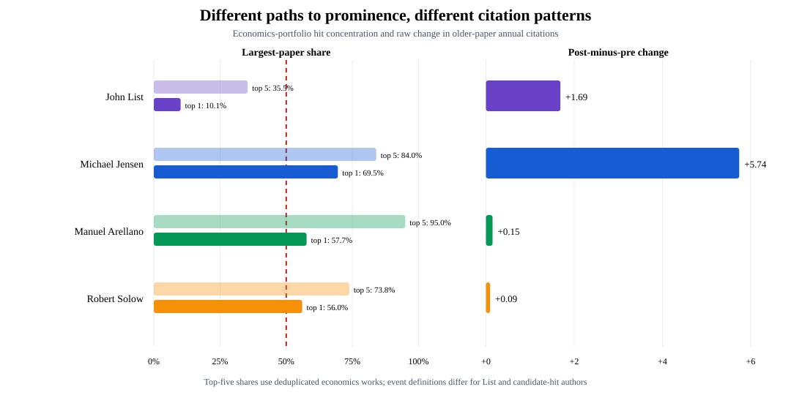
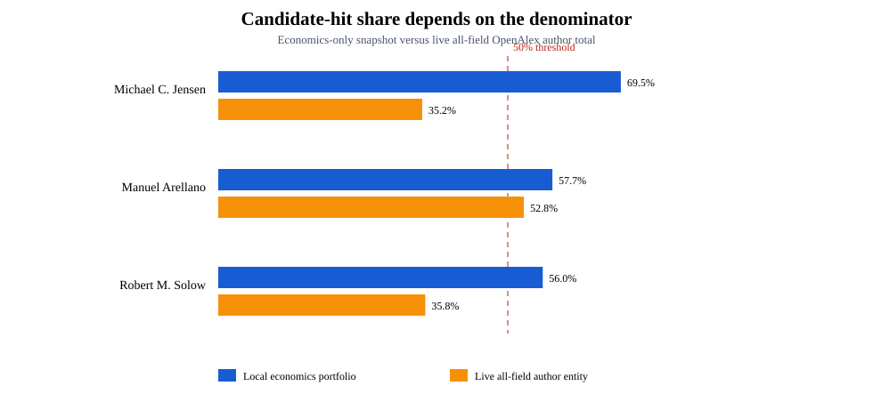
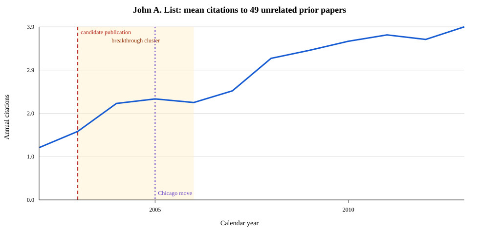
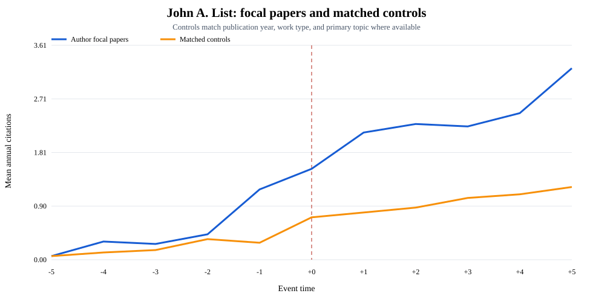

# Author-level presentation results

## Research question

When an economist becomes prominent, do their older papers receive additional
citations—even when those papers are unrelated to the work producing the rise?

For the current descriptive work:

- An older paper is called unrelated when the candidate hit does not cite it.
- The event begins in the candidate paper's publication year.
- A baseline big hit receives more than 50% of the author's citations, subject
  to a provisional minimum career-citation threshold.

These definitions are useful for screening. They are not yet a causal research
design.

## Central comparison: different paths to prominence

John List provides a useful contrast with economists whose prominence is much
more concentrated in one paper.

| Author | Largest economics-paper share | Raw older-paper change | Interpretation |
|---|---:|---:|---|
| John List | 10.1% | +1.686 | Gradual, multi-paper prominence; pretrend fails |
| Michael Jensen | 69.5% | +5.740 | Concentrated hit; large rise but pretrend fails |
| Manuel Arellano | 57.7% | +0.150 | Concentrated hit; small rise |
| Robert Solow | 56.0% | +0.093 | Concentrated hit; sparse, near-zero rise |

This juxtaposition is more informative than presenting the authors as four
versions of the same treatment. A dominant paper is not necessary for a visible
rise in older-paper citations, and a dominant paper does not guarantee a large
rise. The result is descriptive because List's event represents a breakthrough
period, while the other events represent publication of a candidate hit.

The author cases show patterns consistent with citation spillovers, but none is
currently a clean causal example:

1. John List illustrates gradual prominence and a visible rise in citations to
   older work, but he never meets the 50% big-hit rule.
2. Michael Jensen has the largest raw increase, but it begins before the event.
3. Manuel Arellano is the only provisional all-field 50% case, but his author
   record needs identity cleaning and his matched estimate is negative.
4. Robert Solow's older-paper citation counts are too sparse for a persuasive
   individual estimate.

The cases therefore motivate heterogeneity in the subject-level analysis:
compare gradual versus concentrated prominence instead of imposing a single
50% treatment definition on every author.

## Result 1: the definition of a big hit matters

The initial screen used citations within the economics database. The broader
OpenAlex author total covers all works assigned to the author across fields.
Changing this denominator changes who qualifies.

| Author | Candidate paper | Economics share | Recorded all-field share | All-field share above 50%? |
|---|---|---:|---:|---|
| Michael Jensen | *Theory of the Firm* (1976) | 69.5% | 35.2% | No |
| Manuel Arellano | *Some Tests of Specification for Panel Data* (1991) | 57.7% | 52.8% | Provisionally |
| Robert Solow | *A Contribution to the Theory of Economic Growth* (1956) | 56.0% | 35.8% | No |

Presentation interpretation: the 50% rule cannot be applied to a
subject-restricted portfolio without changing its meaning. The preferred
screen should use a cleaned, all-field author portfolio and report alternative
thresholds rather than treating 50% as immutable.

## Result 2: John List is the best prominence-path illustration

John List is substantively useful because his prominence developed over time,
not because a single paper dominates his career citations.

| Quantity | Result |
|---|---:|
| Economics works in the local profile | 187 |
| Local economics work citations | 11,977 |
| Reconstructed economics citations | 12,030 |
| Difference between local totals | 53 (0.44%) |
| Recorded all-field OpenAlex citations | 46,684 |
| Top economics-paper share | 10.1% |
| Fixed cohort of older unrelated papers | 49 |

The local citation calculation is internally consistent. Its difference from
the author-page total is principally a universe problem: the local profile is
economics-only, whereas the author page is all-field and contains many more
assigned works.

For the fixed cohort of 49 older papers, mean annual citations increase from
1.18 in 2002 to approximately 3.02 in 2007–09.

The increase is highly concentrated:

| Concentration diagnostic | Result |
|---|---:|
| Total change across 49 papers | +90.0 citations |
| Share attributable to the largest contributor | 35.9% |
| Share attributable to the five largest contributors | 87.4% |
| Papers with positive / zero / negative changes | 21 / 20 / 8 |

This is more consistent with a heterogeneous spillover than a uniform lift to
the entire back catalog. It could also reflect renewed interest in particular
topics, several contemporaneous breakthrough papers, or List's 2005 move to
Chicago. Citations were already rising before the 2003 candidate event.

## Result 3: the other candidate profiles are not equally credible

Unadjusted means compare event years −5:−1 with 0:+4 for a fixed cohort of
older papers.

| Author | Older-paper clusters | Pre mean | Post mean | Raw change | Main limitation |
|---|---:|---:|---:|---:|---|
| Michael Jensen | 10 | 3.100 | 8.840 | +5.740 | Strong upward pretrend |
| Manuel Arellano | 12 | 0.167 | 0.317 | +0.150 | Identity contamination; very small counts |
| Robert Solow | 15 | 0.187 | 0.280 | +0.093 | Very sparse outcome |

Jensen's large raw change is visually striking, but the rise is underway before
1976. Arellano's OpenAlex entity contains an obvious 1912 namesake record.
Solow's mean changes by less than one tenth of a citation per paper-year.

The original profiles remain available for inspection:

- [Michael Jensen](../8.7.26/author_hit_profiles/michael_c_jensen_event_time.svg)
- [Manuel Arellano](../8.7.26/author_hit_profiles/manuel_arellano_event_time.svg)
- [Robert Solow](../8.7.26/author_hit_profiles/robert_m_solow_event_time.svg)

## Result 4: metadata-matched controls do not resolve the design

Each focal paper was paired with one control having the same publication year
and document type, and the same primary topic when available. The comparison
again uses event years −5:−1 and 0:+4.

| Author | Focal change | Control change | Difference in changes | Pretrend assessment |
|---|---:|---:|---:|---|
| John List | +1.686 | +0.710 | +0.976 | Fails |
| Michael Jensen | +5.740 | +0.520 | +5.220 | Fails |
| Manuel Arellano | +0.150 | +0.400 | −0.250 | Passes loose screen |
| Robert Solow | +0.093 | −0.013 | +0.107 | Passes loose screen |

The two large positive differences are precisely the cases that fail the
pretrend screen. Among the two cases passing the loose screen, one estimate is
negative and the other is close to zero in absolute citation units. Matching
only on metadata is therefore inadequate.

For presentation, use John List's comparison to illustrate the problem rather
than treating the table as causal evidence:

## What can be claimed

The current author-level results support three claims:

- Citation growth to an author's older work can accompany rising prominence.
- That growth may be concentrated in a small subset of older papers.
- Naive before/after and metadata-matched comparisons do not separate a
  prominence spillover from prior trends, topic demand, and career changes.

They do **not** establish that publication of a hit causes additional citations
to unrelated work.

## Recommended presentation sequence

1. Lead with the List-versus-concentrated-hit comparison figure.
2. Use John List's timeline to illustrate gradual prominence.
3. Show the denominator figure to explain why classification is provisional.
4. Show the concentration statistics: both prominence across an author's
   portfolio and spillovers across older papers can be concentrated.
5. Show the matched comparison and emphasize the failed pretrend.
6. Transition to subject-level heterogeneity by type of prominence event.

## Immediate author-level improvements

Before elevating any case to primary evidence:

1. Clean and freeze each author's all-field OpenAlex identity and portfolio.
2. Cluster duplicate work versions before calculating hit shares or outcomes.
3. Replace one metadata control with a donor pool matched on the entire
   pre-event citation path.
4. Normalize each focal paper against papers of the same age, calendar year,
   type, and topic.
5. Estimate leave-one-paper-out results and report the distribution of
   paper-level effects, not only the author mean.
6. Add placebo event years and alternative prominence events, including
   threshold crossing, institutional moves, awards, and clusters of hits.

## Supporting files

- [Author profiles](../8.7.26/author_hit_profiles/author_hit_profiles.csv)
- [Author contrast data](../8.7.26/author_hit_profiles/author_prominence_contrast.csv)
- [John List paper contributions](../8.7.26/john_list_case_study/paper_contributions.csv)
- [Matched-control summary](../8.7.26/author_matched_controls/matched_control_summary.csv)
- [Matched pairs](../8.7.26/author_matched_controls/matched_pairs.csv)
