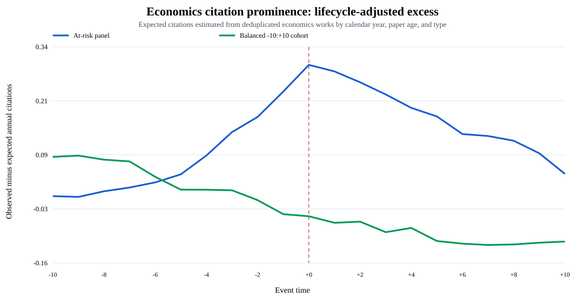
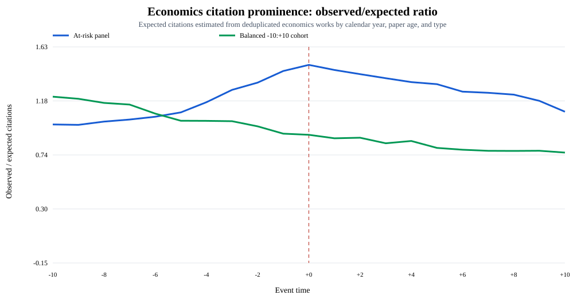

# Economics subject time series

| Sample | Units | Authors | Event window |
|---|---:|---:|---:|
| Original hit panel | 75,882 | 11,155 | −10:+10 |
| Balanced paper-level panel | 14,076 | 3,667 | −10:+10 |

## Original

| Pre window | Post window | Pre mean | Post mean | Change |
|---:|---:|---:|---:|---:|
| −5:−1 | 0:+4 | 0.516 | 0.864 | +0.348 |

## Publication risk

| Event time | Rows before focal-paper publication |
|---:|---:|
| −10 | 72.0% |
| −5 | 44.0% |
| −2 | 13.4% |
| −1 | 0.0% |

At risk: focal paper observed only at paper age ≥ 0.

## Age-standardized

| Series | Pre mean | Post mean | Change |
|---|---:|---:|---:|
| Original | 0.516 | 0.864 | +0.348 |
| Age-standardized | 0.636 | 0.849 | +0.213 |

Age bins: 3–5, 6–10, 11–20, and 21+ years. Weights fixed at event −1.

## Paper-level excess citations

| Sample | Pre | Post | Change |
|---|---:|---:|---:|
| Publication at risk | 0.137 | 0.252 | +0.114 |
| Balanced −10:+10 | −0.006 | −0.068 | −0.063 |

Excess citations = observed annual citations − expected annual citations.

## Paper-level observed/expected ratio

| Sample | Pre | Post | Change |
|---|---:|---:|---:|
| Publication at risk | 1.260 | 1.406 | +0.146 |
| Balanced −10:+10 | 0.989 | 0.871 | −0.119 |

Expected citations: deduplicated economics works matched on calendar year,
exact paper age, and document type.
