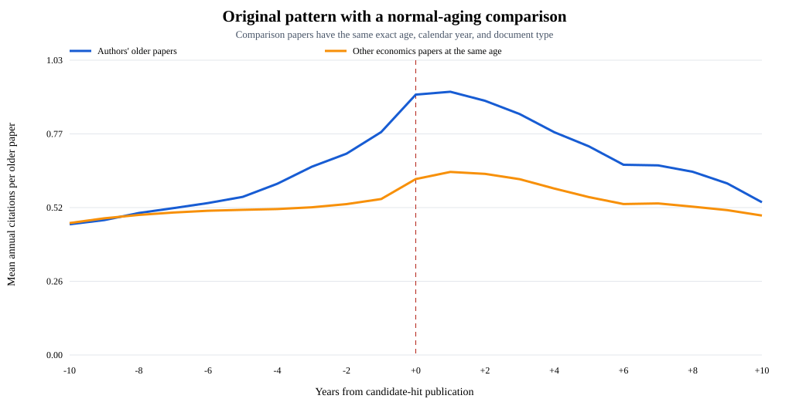
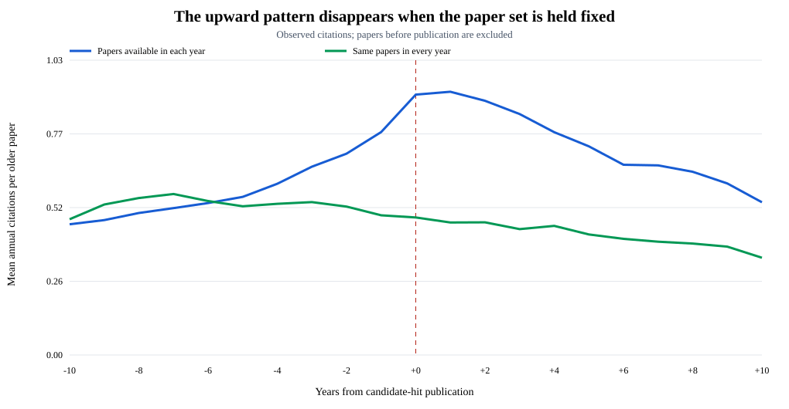
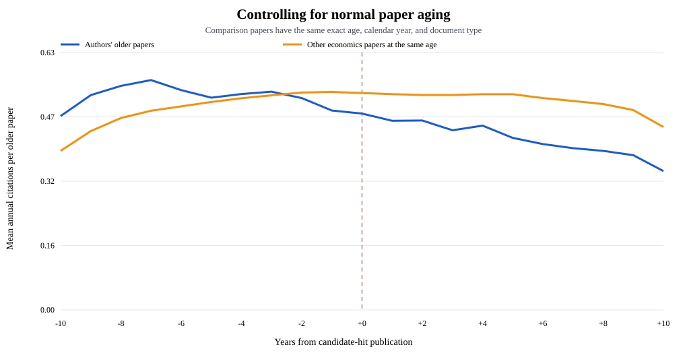

# Economics subject time series

## Original pattern

| Year | −5 | −2 | −1 | 0 | +1 | +2 | +4 |
|---:|---:|---:|---:|---:|---:|---:|---:|
| Mean citations | 0.310 | 0.610 | 0.781 | 0.912 | 0.922 | 0.890 | 0.761 |

## Original pattern with paper-age control

| Series | Pre mean | Post mean | Change |
|---|---:|---:|---:|
| Authors' older papers | 0.660 | 0.870 | +0.210 |
| Other economics papers at the same age | 0.522 | 0.618 | +0.096 |
| Difference | +0.137 | +0.252 | +0.114 |

| Post-event decline | Year 0 | Year +10 | Decline |
|---|---:|---:|---:|
| Authors' older papers | 0.912 | 0.535 | −0.377 |
| Other economics papers at the same age | 0.616 | 0.488 | −0.128 |

Normal aging accounts for 34.0% of the observed decline from year 0 to +10.

## Same papers over time

| Sample | Units at −10 | Units at 0 | Pre mean | Post mean | Change |
|---|---:|---:|---:|---:|---:|
| Papers available in each year | 21,244 | 75,882 | 0.660 | 0.870 | +0.210 |
| Same papers in every year | 14,076 | 14,076 | 0.519 | 0.461 | −0.058 |

## Controlling for paper age

| Series | Pre mean | Post mean | Change |
|---|---:|---:|---:|
| Authors' same older papers | 0.519 | 0.461 | −0.058 |
| Other economics papers at the same age | 0.525 | 0.529 | +0.004 |
| Difference | −0.006 | −0.068 | −0.063 |

For every author paper-year, the comparison is calculated from deduplicated
economics papers with the exact same paper age, calendar year, and document
type. The comparison therefore follows the normal citation lifecycle as both
sets of papers grow older.

## Big picture

- Original: citations rise before year 0, peak near years 0:+1, then decline.
- Paper-age control: normal aging explains about one third of the decline from
  year 0 to +10; the remaining decline is larger than the same-age benchmark.
- Changing paper set: positive pre/post change.
- Same paper set: no positive trend around year 0.
- Exact paper-age comparison: no positive relative trend.
