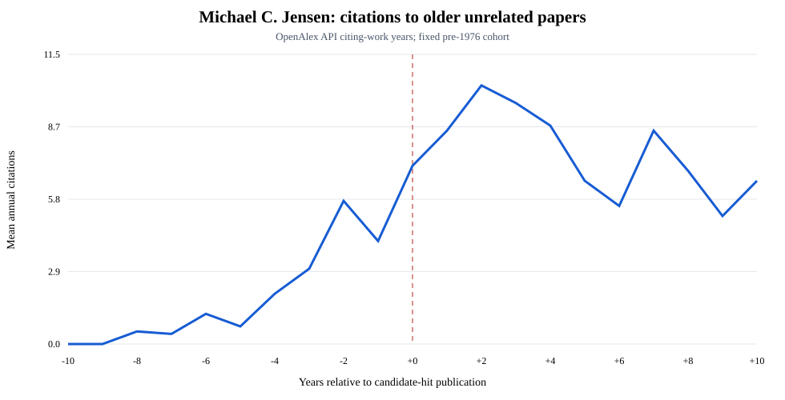
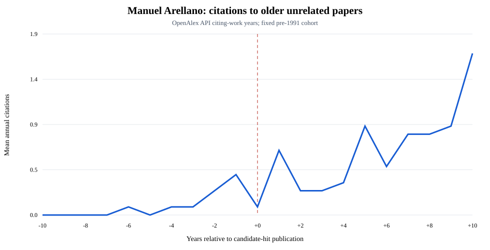
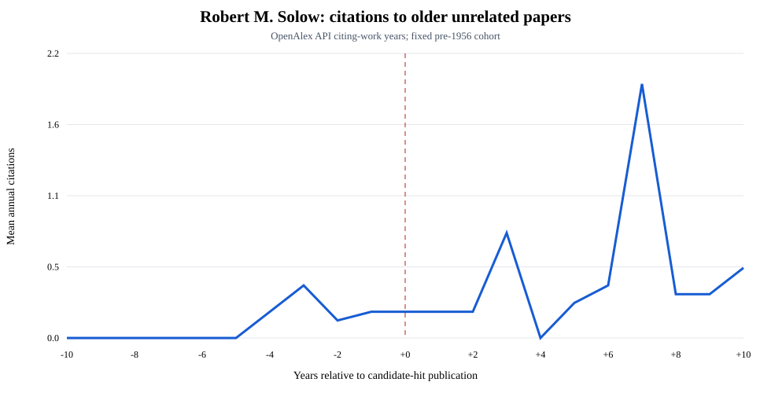

# Jensen, Arellano, and Solow: exploratory hit profiles

> **Descriptive and provisional.** Live OpenAlex author entities contain
> identity errors and work versions. Event series use fixed, version-clustered
> cohorts of attributed older works not referenced by the candidate hit. They
> are not causal estimates.

| Author | Hit year | Economics share | All-field share | Prior clusters | Pre mean | Post mean | Difference |
|---|---:|---:|---:|---:|---:|---:|---:|
| Michael C. Jensen | 1976 | 69.5% | 35.2% | 10 | 3.100 | 8.840 | +5.740 |
| Manuel Arellano | 1991 | 57.7% | 52.8% | 12 | 0.167 | 0.317 | +0.150 |
| Robert M. Solow | 1956 | 56.0% | 35.8% | 15 | 0.187 | 0.280 | +0.093 |

## Author event figures

## Identity warnings

- Arellano's entity includes a 1912 geography record, an obvious namesake error.
- Jensen's attributed pre-hit portfolio includes duplicated versions and a likely namesake record.
- Version clustering is conservative and does not establish author identity.
