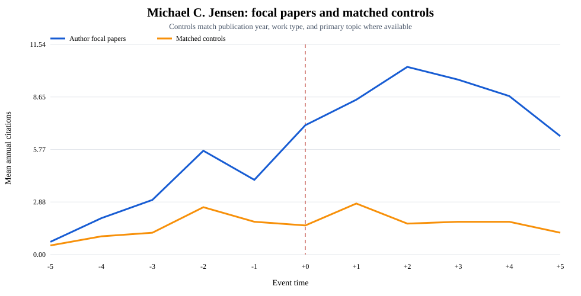
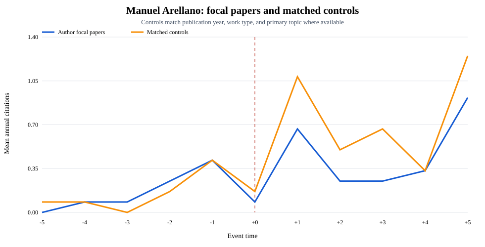
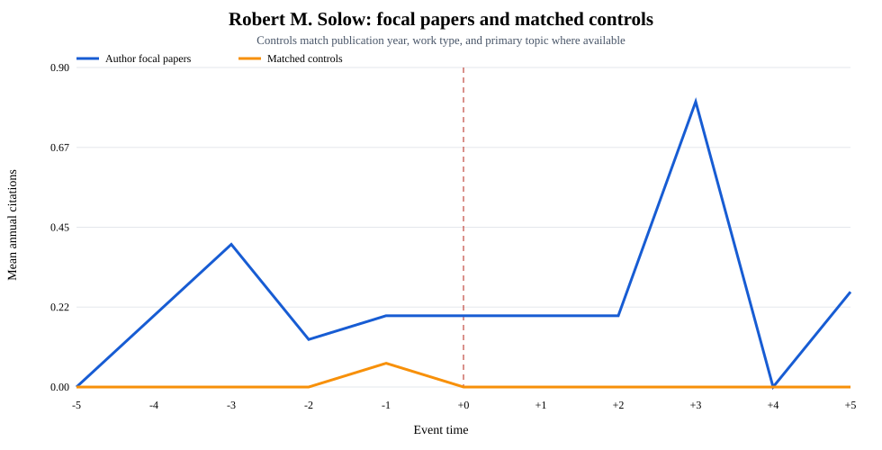

# API-derived author matched controls

Each focal paper is paired to one randomly sampled OpenAlex control with the
same publication year and work type, and the same primary topic when available.
Annual outcomes count citing works by publication year. Figures span event
-10:+10; the table compares event -5:-1 with 0:+4.

## Original unadjusted figures

The original figures are preserved unchanged:

- [John List original figure](../john_list_case_study/unrelated_prior_citations.svg)
- [Michael Jensen original figure](../author_hit_profiles/michael_c_jensen_event_time.svg)
- [Manuel Arellano original figure](../author_hit_profiles/manuel_arellano_event_time.svg)
- [Robert Solow original figure](../author_hit_profiles/robert_m_solow_event_time.svg)

The matched-control figures below are additional specifications, not replacements.

| Author | Focal papers | Focal change | Control change | Difference in changes | Pretrend slope gap | Parallel flag |
|---|---:|---:|---:|---:|---:|---|
| John A. List | 49 | +1.686 | +0.710 | +0.976 | +0.169 | no |
| Michael C. Jensen | 10 | +5.740 | +0.520 | +5.220 | +0.630 | no |
| Manuel Arellano | 12 | +0.150 | +0.400 | -0.250 | +0.025 | yes |
| Robert M. Solow | 15 | +0.093 | -0.013 | +0.107 | +0.020 | yes |

> **Exploratory, not causal.** Matching does not yet enforce pre-trend balance;
> OpenAlex identities and work versions remain imperfect, and one control per
> focal paper produces sampling noise.

