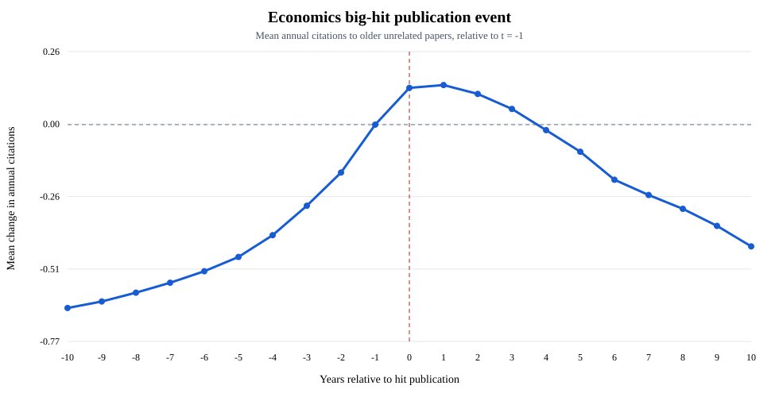
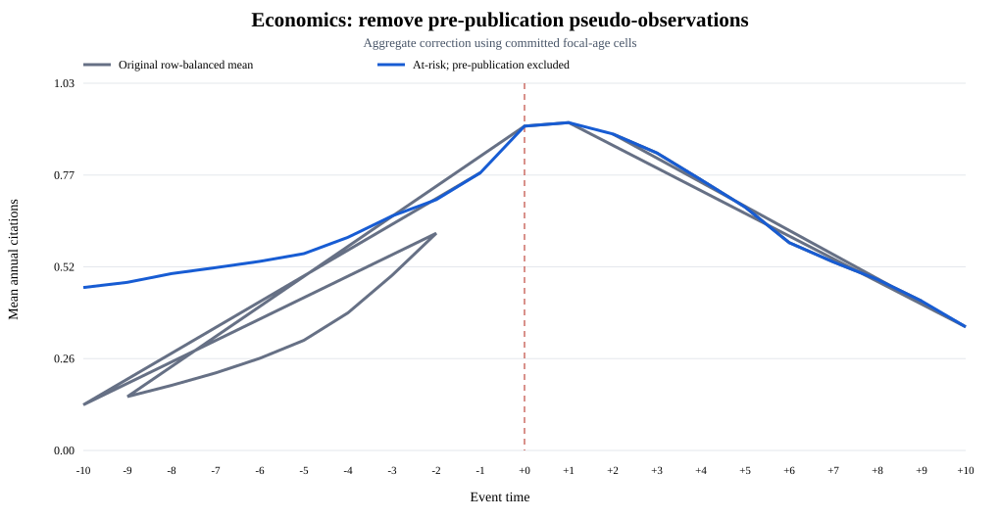
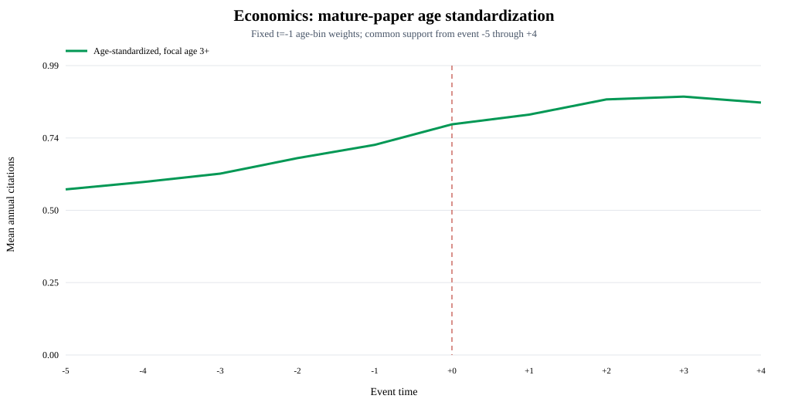

# Economics age and risk-set adjustments

These outputs use committed aggregate cells and do not require the external SSD.

## Original unadjusted figure

The original figure is preserved unchanged:

Original data: [`economics_big_hit_event_time.csv`](../economics_subject_level/economics_big_hit_event_time.csv).

The first adjustment excludes observations before focal-paper publication. The
second standardizes mature focal papers (ages 3–5, 6–10, 11–20, and 21+) to the
age-bin distribution observed at event time -1 over the common -5:+4 window.

The standardized pre/post means are **0.636** and **0.849**, a raw
difference of **+0.213**. This remains descriptive cell reweighting,
not a paper-level controlled regression or causal estimate.

