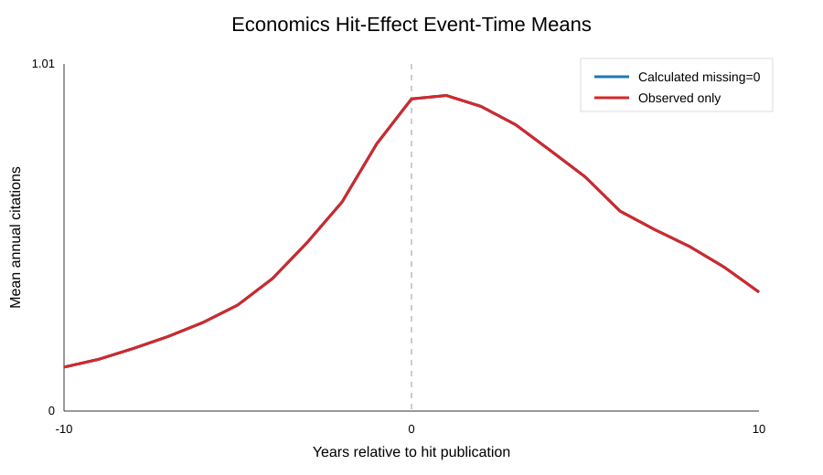

# Economics Hit-Effect Analysis

This folder is generated from the economics subject database on the SSD.

- Hit events: 11,158
- Focal work IDs: 70,986
- Event-panel rows: 1,597,554
- Mean added annual citations: 0.3172

Aggregated econometrics tables, when available, are copied into `econometrics_summaries/`.
The large pair-level pre/post delta file is kept on the SSD and is not committed.
