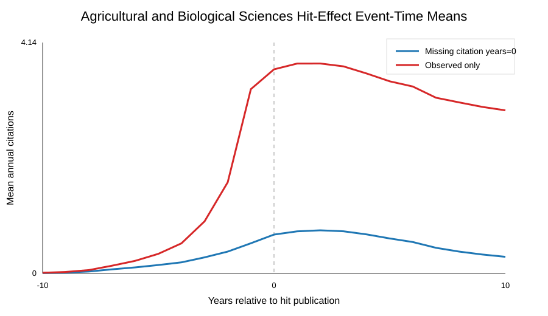

# Agricultural and Biological Sciences Hit-Effect Baseline

This folder is generated immediately after the subject-level hit-effect analysis finishes.

- Citation source: openalex_counts_by_year
- Works: 13,802,779
- Hit events: 32,578
- Focal paper-author-hit pairs: 233,060
- Event-panel rows: 4,894,260
- Missing citation-year rate: 70.60%
- Mean pre-hit annual citations: 0.1814
- Mean post-hit annual citations: 0.5783
- Added annual citations, zero-filled: 0.3969

