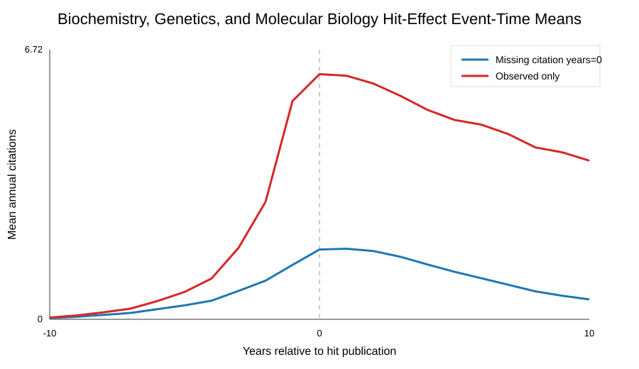

# Biochemistry, Genetics, and Molecular Biology Hit-Effect Baseline

This folder is generated immediately after the subject-level hit-effect analysis finishes.

- Citation source: openalex_counts_by_year
- Works: 13,360,774
- Hit events: 93,752
- Focal paper-author-hit pairs: 578,505
- Event-panel rows: 12,148,605
- Missing citation-year rate: 63.97%
- Mean pre-hit annual citations: 0.4465
- Mean post-hit annual citations: 1.1795
- Added annual citations, zero-filled: 0.7330

