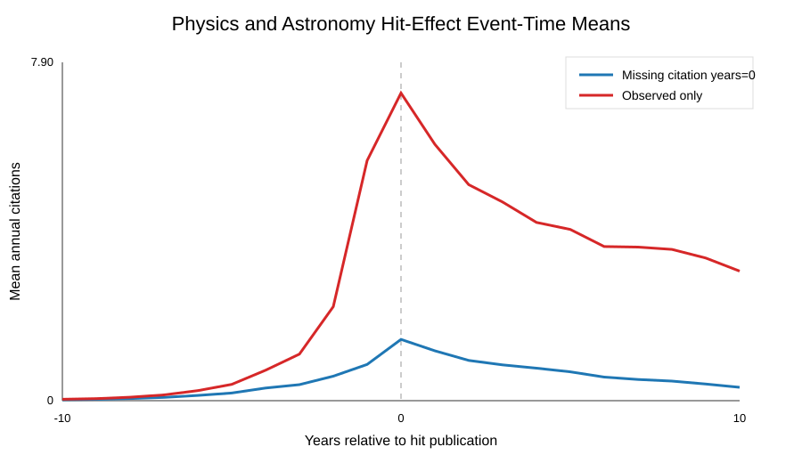

# Physics and Astronomy Hit-Effect Baseline

This folder is generated immediately after the subject-level hit-effect analysis finishes.

- Citation source: openalex_counts_by_year
- Works: 11,592,579
- Hit events: 33,345
- Focal paper-author-hit pairs: 301,816
- Event-panel rows: 6,338,136
- Missing citation-year rate: 69.48%
- Mean pre-hit annual citations: 0.2568
- Mean post-hit annual citations: 0.7278
- Added annual citations, zero-filled: 0.4710

